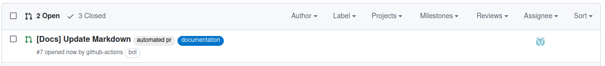

# Markdown Toolkit


_A python library for creating and manipulating markdown with an object oriented interface._

This library has two primary aims:
* Generation of markdown with python to create documents or fragments of documents.
* Injection of text; static or generated, into existing documents.

## Quickstart

_**WARNING**:_ _This project isn't version 1.0.0 yet, API subject to change, pin the version._

These steps outline a usecase end to end; dynamically generating some content and injecting it into an existing document, and then raising a pull request.

1.  Install package (Preferably in your python [virtual environment](https://docs.python.org/3/library/venv.html), or container).
    ```shell
    pip install markdown-toolkit
    ```
1.  Write a simple test document 
    <!--- markdown-toolkit:readme_example --->
    ```python
    """README.md Example Code."""
    import requests
    from markdown_toolkit import MarkdownDocument
    
    doc = MarkdownDocument()
    
    quotes = requests.get("http://ron-swanson-quotes.herokuapp.com/v2/quotes/10")
    with doc.heading("Ron Swanson Quotes"):
        doc.paragraph("This list is generated from a JSON serving REST API call.")
        for quote in quotes.json():
            doc.list(quote)
    
    print(doc.render())
    ```
    <!--- markdown-toolkit:readme_example --->
    
    Which gives a result of:
    ```markdown 
    # Ron Swanson Quotes

    This list is generated from a JSON serving REST API call.

    *   In my opinion, not enough people have looked their dinner in the eyes and considered the circle of life.
    *   Barbecues should be about one thing: good shared meat.
    *   It's an impossible puzzle, and I love puzzles!
    *   Under my tutelage, you will grow from boys to men. From men into gladiators. And from gladiators into Swansons.
    *   I love riddles!
    *   If any of you need anything at all, too bad. Deal with your problems yourselves, like adults.
    *   I like Tom. He doesn’t do a lot of work around here. He shows zero initiative. He’s not a team player. He’s never wanted to go that extra mile. Tom is exactly what I’m looking for in a government employee.
    *   When I eat, it is the food that is scared.
    *   Once a year, every branch of this government meets in a room and announces what they intend to waste taxpayer money on.
    *   Give 100%. 110% is impossible. Only idiots recommend that.
    ```

1. Combining the two is flexible, allowing dynamic generation of markdown partial documents, and injection of those into human edited pages.

    Here is a live example from [inject_readme.py](inject_readme.py) which injects content into this file:

    <!--- markdown-toolkit:pycode --->
    ```python
    from markdown_toolkit import MarkdownInjector, MarkdownDocument
    
    # Open the document to manipulate and read it into the injector
    with open("README.md", "r", encoding="UTF-8") as source:
        source_file = MarkdownInjector(source)
    
    # Open a second file to inject into the document
    with open("readme_example.py", "r", encoding="UTF-8") as code:
        doc = MarkdownDocument()
        # Wrap the raw document in code tags
        with doc.codeblock(language="python"):
            doc.paragraph(code.read(), linebreak=False)
        # Replace text between anchor tags with value of file
        source_file.anchors.readme_example.value = doc.render()
    
    # Always try to render the resulting document before writing,
    # so any failures don't result in an empty or corrupted file
    resulting_document = source_file.render()
    with open("README.md", "w", encoding="UTF-8") as source:
        source.write(resulting_document)
    ```
    <!--- markdown-toolkit:pycode --->

    In this case the `inject_readme.py` reads itself to inject into this document, as well as the `readme_example.py` file containing some source code.

1.  To finish it off, there's an example of running this code in a Github Actions pipeline to keep the documentation updates.

    ```yaml
    name: Generate documentation
    
    permissions:
      contents: write
      pull-requests: write
    
    on: pull-request

    jobs:
      rebuild-readme:
        name: Script building README.md
        runs-on: ubuntu-latest
        steps:
          - uses: actions/checkout@v3
            with:
              ref: ${{ github.head_ref }}
          - name: Set up Python
            uses: actions/setup-python@v3
            with:
              python-version: "3.7"
              architecture: x64
              cache: pip
          - run: pip install markdown-toolkit
          - run: python inject_readme.py
          - name: Create Pull Request
            id: cpr
            uses: peter-evans/create-pull-request@v4
            with:
              commit-message: "docs: update markdown"
              committer: GitHub <noreply@github.com>
              author: ${{ github.actor }} <${{ github.actor }}@users.noreply.github.com>
              signoff: false
              branch: docs
              delete-branch: true
              title: '[Docs] Update Markdown'
              body: |
                Update report
                - Updated with `examples/generate_documentation.py`
                - Auto-generated by [create-pull-request][1]
    
                [1]: https://github.com/peter-evans/create-pull-request
              labels: |
                documentation
                automated pr
              team-reviewers: |
                owners
                maintainers
    ```

    _This action doesn't get triggered in this project, it just serves as an example._

    When this action runs it creates a pull request:
    

    Just merge the changes to update the markdown.


## Examples

Further more detailed examples can be found in the [Examples](./examples) and in the [Unit Tests](./tests) directories.